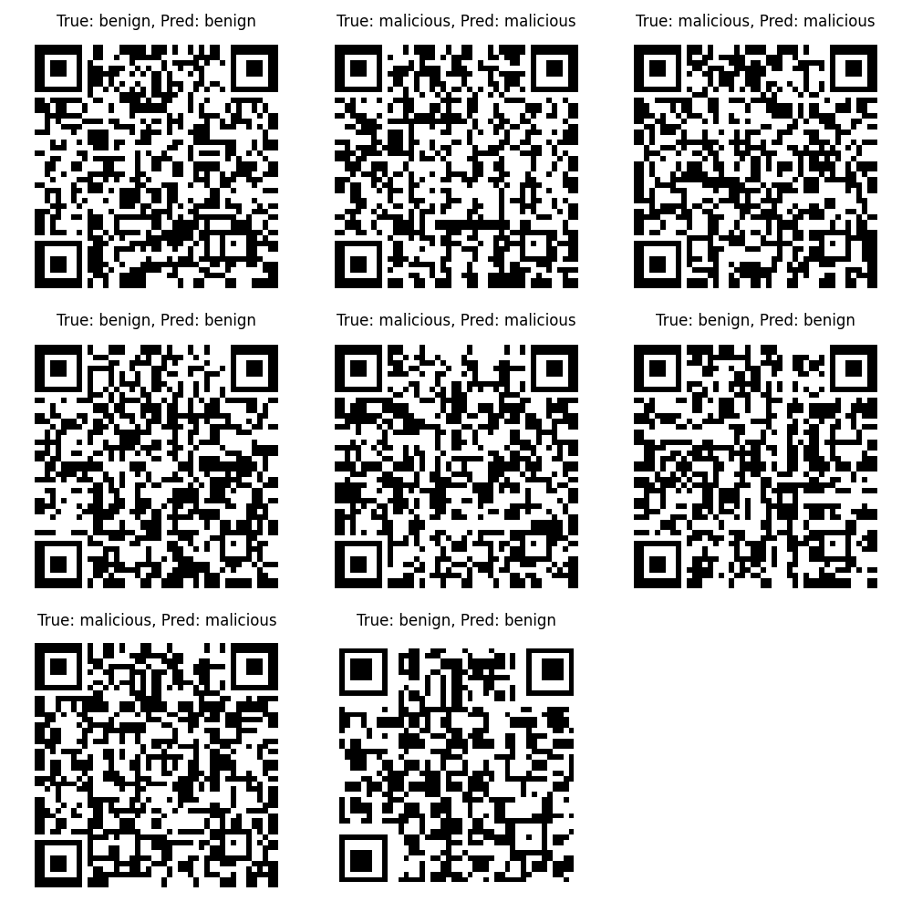
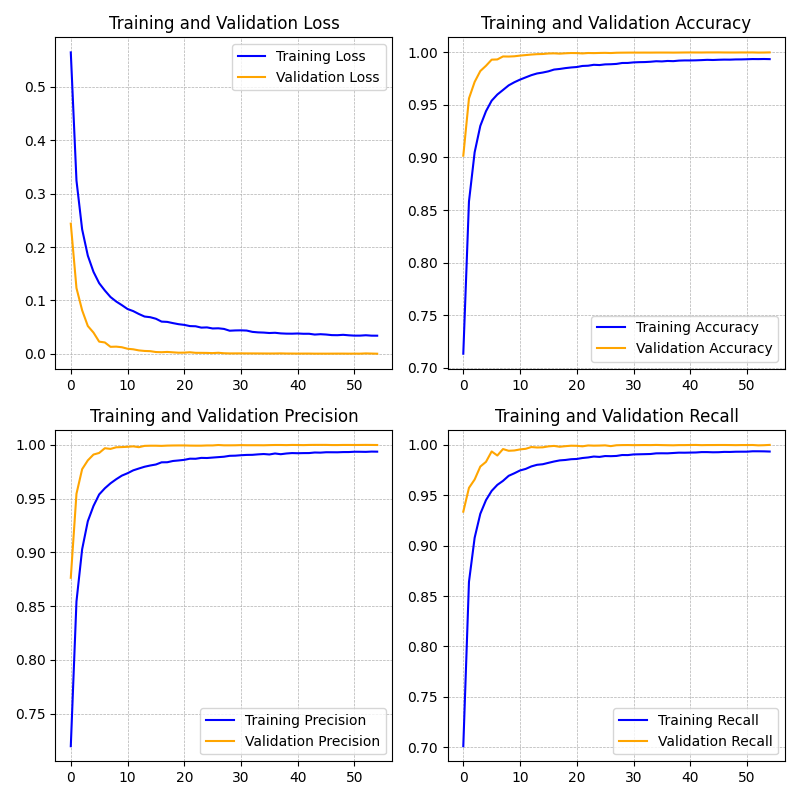
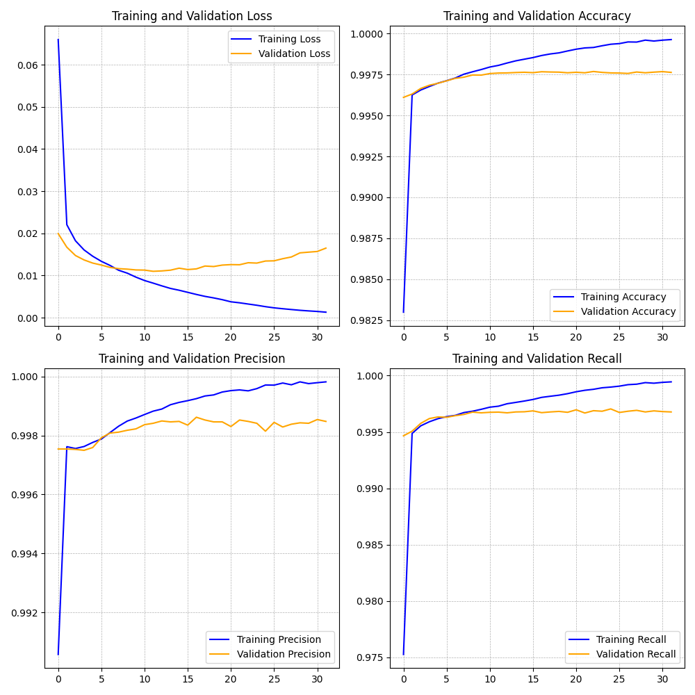
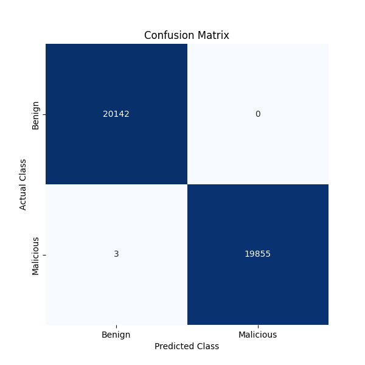
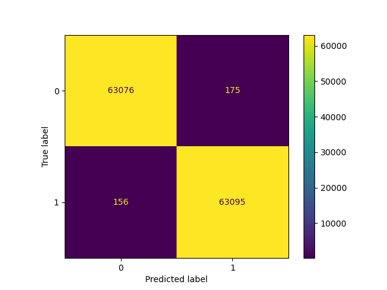

# 🚀 AI-Driven QR Code Security Scanner

## 🌟 Project Overview

QR codes have become an integral part of our digital lives, appearing on menus, payment terminals, and more. However, with convenience comes risk, as QR codes can easily conceal malicious content. Enter **AI-Driven QR Code Security Scanner**—a robust, deep learning-based project designed to classify QR codes as either safe or potentially harmful.

This project takes two unique and powerful approaches:

1. **2D Convolutional Neural Network (2D-CNN)**: Analyzes the visual structure of QR codes.
2. **1D Convolutional Neural Network (1D-CNN)**: Decodes QR codes into strings and assesses their safety.

## 🧠 Key Approaches

### 1. Image-Based Analysis (2D-CNN)

- **Model Insight**: Uses a deep 2D-CNN to examine the visual data of QR codes. This approach allows the model to learn intricate patterns that distinguish benign from malicious codes.
- **Data Augmentation**: To increase robustness and simulate real-world scenarios, images were rotated at 90°, 180°, and 270°, enhancing the model's ability to classify QR codes regardless of their orientation.
- **Model Architecture**: My custom model design from scratch using advanced techniques.

### 2. String-Based Analysis (1D-CNN)

- **Model Insight**: The project also implements a 1D-CNN that decodes QR code images into URL strings and then processes these strings for classification. This method bridges visual analysis and text-based analysis.
- **Preprocessing**: Used **PyZBar** to decode QR code images into URLs for model input.
- **Model Architecture**: My custom model design from scratch using advanced techniques.

## 📊 Results and Metrics

### Performance Highlights

- **Precision & Recall**: A fine balance is maintained to minimize false alarms and capture true threats.
- **Confusion Matrices**: Illustrate the performance of each model by showing true positives, true negatives, false positives, and false negatives.
- **Training and Validation Curves**: Display the learning behavior over epochs.

### Classification Results

Here's an image showcasing sample outputs from the classification results:

### Example Visuals

- **2D-CNN Training Accuracy**:
  
- **1D-CNN Confusion Matrix**:
  

## 🛠️ Technologies at Work

- **Python**: Core programming language.
- **TensorFlow/Keras**: Frameworks for deep learning.
- **OpenCV**: For image processing and data augmentation.
- **PyZBar**: Decodes QR code images into strings.
- **NumPy & Pandas**: Essential for data handling and preprocessing.
- **Matplotlib & Seaborn**: Used for creating clear, detailed visual plots.

## 🚦 Training Workflow

1. **Data Augmentation**: Expanded the training dataset by rotating QR code images to 90°, 180°, and 270° to boost generalization.
2. **Model Training**: Independently trained 2D and 1D models to optimize their performance in respective domains.
3. **Evaluation**: Assessed using metrics like precision, recall, F1-score, and confusion matrices.

## 🚧 Challenges and Solutions

- **Challenge**: Ensuring that the 2D-CNN model effectively recognized QR codes in different orientations.
  - **Solution**: Implemented data augmentation strategies to train the model on rotated images.
- **Challenge**: Effectively translating encoded URLs for the 1D-CNN.
  - **Solution**: Integrated **PyZBar** for precise decoding and built a comprehensive string preprocessing pipeline.

## 📈 Detailed Results

### 2D-CNN Insights

- **High Precision & Recall**: Balances low false positive rates with high detection of malicious codes.
- **Training and Validation Loss**:
  

### 1D-CNN Insights

- **Effective String Analysis**: Captures subtle patterns in URL strings to differentiate between safe and malicious links.
- **Training Accuracy and Loss**:
  

## 🔮 Future Enhancements

- **Real-Time Mobile Integration**: Adapt the scanner for mobile platforms for on-the-go QR scanning.
- **User-Friendly Web Interface**: Create a web application for easy access and scanning.
- **Hybrid Model**: Merge the strengths of both 2D and 1D approaches for enhanced accuracy.
- **Advanced Augmentation**: Introduce additional data augmentation like noise, skewing, and warping.

## 🔗 Contributing

Want to make this even better? Fork the project, submit pull requests, or open issues for discussion.

## 📬 Contact

Questions or suggestions? Reach out via [mail](ramyibrahim987@gmail.com).
